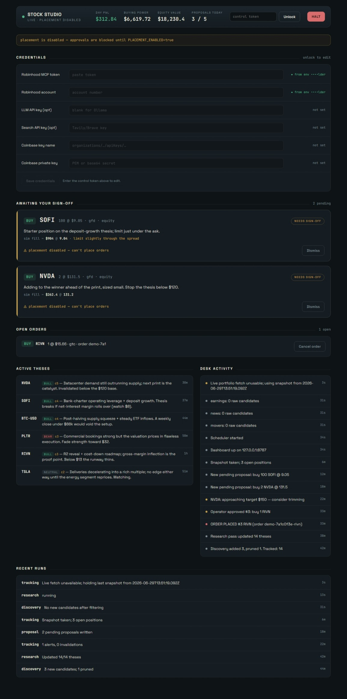
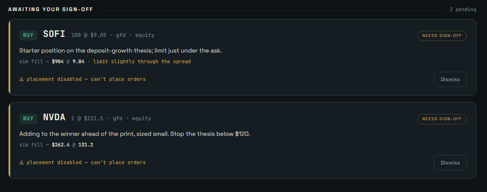
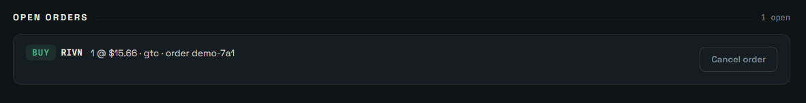

# Stock Studio

> ⚠️ **Handles a real brokerage account and can place real orders with real money.** Educational /
> personal tooling, provided as-is with no warranty — **not investment advice**. Run with
> `PLACEMENT_ENABLED=false` until you've read the code and trust it. You are responsible for every
> order placed. See [the safety model](#the-safety-model) and the [LICENSE](LICENSE).

An autonomous research / tracking / trade-proposal desk for equities, ETFs, options, and
crypto, wired to the **Robinhood MCP**. Same self-hosted spirit as your agent studio: a
long-running agent loop plus a private dashboard, all on one box.

**It is autonomous everywhere except the last inch.** Discovery (finding fresh candidates),
research, tracking, thesis-keeping, and trade *proposals* all happen on their own. Placing a
real order requires you to click Approve on the dashboard and type the ticker to arm it — and
you can cancel a resting order from the same console. Nothing reaches your brokerage without
that approval click.

<p align="center">
  
</p>

> Not investment advice. This is tooling that operates *your* account under *your* sign-off.
> You are responsible for every order placed. Start with `PLACEMENT_ENABLED=false`.

---

## How it fits together

```
                 ┌──────────────── your server (reaches Robinhood + your LLM) ─────────────┐
                 │                                                                          │
  local LLM    ←─┼─ agent loop ── discovery ─┐                                              │
  (Ollama, /v1)  │   (scheduler)  research ──┤                                              │
  web search   ←─┤                tracking ──┼─→ SQLite (node:sqlite) ──→ Express dashboard │→ you (tailnet)
  Robinhood MCP ←┤                proposals ─┘   theses / proposals / discovered / events   │   approve/cancel/halt
  (local client) │                                                                          │
                 │   approve click ──→ placeApprovedOrder() ──→ Robinhood MCP (place tool)  │
                 │   cancel click  ──→ cancelOrder()        ──→ Robinhood MCP (cancel tool) │
                 └──────────────────────────────────────────────────────────────────────────┘
```

The agent "thinks" by calling a **local, OpenAI-compatible LLM** (Ollama by default) for all
reasoning. Robinhood is reached by a **deterministic local MCP client** (`src/mcp/robinhood-client.js`)
— *our* code decides which tools to call and calls them directly; the model only ever sees the
results as data and never drives tools (including placement). Fresh news comes from a pluggable
web-search provider. All state lives in a local SQLite file. The dashboard reads that state and is
the only place orders get approved or cancelled.

The passes form a pipeline: **discovery** pulls fresh candidate symbols (movers / breakout news /
upcoming earnings) into the research universe; **research** forms a skeptical thesis per symbol;
**tracking** snapshots the portfolio and watches open positions against their theses; **proposals**
turns high-conviction theses into concrete, rail-checked, deduplicated trade tickets. Portfolio
reads are persisted as snapshots so a transient brokerage hiccup falls back to last-known holdings
rather than blanking out.

## Screenshots

The dashboard is the operator console — research output, the human approval gate, open orders, and
desk activity in one view. The shots below come from the **demo seed** (invented data, no real
account), so you can reproduce them in about a minute — see
[Try it with demo data](#try-it-with-demo-data) and
[docs/screenshots](docs/screenshots/SCREENSHOTS.md).


<p align="center"></p>
<p align="center"></p>
<p align="center"></p>


## Requirements

- Node.js **>= 22.5** (uses the built-in `node:sqlite` — no native build step).
- A local (or any OpenAI-compatible) LLM endpoint — e.g. **Ollama** with an instruct model pulled.
  Set `LLM_BASE_URL` + `MODEL_*`. **Size the model to your hardware:** a 14B (`qwen2.5:14b`) gives
  better theses but needs a GPU — on a CPU-only box it can take minutes per call and time out, so
  use a small fast model there (`llama3.2:3b`). LLM calls are serialized and bounded by
  `LLM_TIMEOUT_MS` so a slow backend degrades gracefully instead of dogpiling. Check what's actually
  loaded on the GPU with `ollama ps` (look for non-zero `size_vram`).
- The Robinhood MCP reachable at a public HTTPS URL (`agent.robinhood.com/mcp/trading`). The local
  MCP client connects to it directly with your bearer token — no third-party cloud is involved.
- A Robinhood brokerage account flagged `agentic_allowed=true` (required for order tools).
- (Optional) a web-search provider — Tavily/Brave API key, or a self-hosted SearXNG URL.

## Setup

```bash
cd stock-studio
cp .env.example .env       # then edit .env
npm install
npm run check              # syntax check
npm start                  # dashboard + in-process scheduler
```

Open `http://127.0.0.1:8787`. Paste your `CONTROL_TOKEN` into the dashboard to unlock the
approve/halt controls.

To run the loop and the dashboard as separate processes instead, start the server with
`RUN_SCHEDULER=false npm start` and run `npm run agent` separately.

### Try it with demo data

Want to see the dashboard without wiring up a brokerage? Seed a throwaway DB with realistic
**fake** data and point the server at it:

```bash
node scripts/seed-demo.mjs                                              # writes ./data/demo.db
DB_PATH=data/demo.db PLACEMENT_ENABLED=false CONTROL_TOKEN=demo npm start
```

Open `http://127.0.0.1:8787` and unlock with the token `demo`. Nothing connects to a real
account, and the scheduler has nothing to do — it's purely for exploring the UI (and capturing
the screenshots above). The seed never touches your real `studio.db`.

## Docker

One image is used for both roles. No native build step (built-in `node:sqlite`), so the image
is small.

```bash
cp .env.example .env       # fill it in; HOST and DB_PATH are set for you by compose
docker compose up -d --build
docker compose logs -f
```

That brings up two containers from the same image — `dashboard` (server + API) and `agent`
(the loop) — sharing one named volume `studio-data` for the SQLite file. Restart or inspect
either independently (`docker compose restart agent`).

**Exposure / networking.** Inside the container the app binds `0.0.0.0`; the real boundary is
the published port. The compose file publishes to `127.0.0.1:8787` only, so out of the box the
dashboard is reachable on the host loopback and nowhere else. To use it from your tailnet, pick one:

- front it with Tailscale: `tailscale serve` pointing at `localhost:8787` (gives HTTPS, stays
  tailnet-only) — check `tailscale serve --help` for the current syntax, or
- change the mapping to your tailscale IP, e.g. `"100.x.y.z:8787:8787"`.

Do **not** publish to `0.0.0.0:8787` unless something else is doing authentication in front.

**Reaching a local Ollama from the containers.** The compose file maps `ollama` →
`host-gateway`, so `LLM_BASE_URL=http://ollama:11434/v1` works when Ollama listens on the Docker
host. **Caveat (WSL2):** if Ollama runs inside a *separate* WSL distro, Docker Desktop's network
can't route to it — `host-gateway`/`host.docker.internal` only reach the Windows host, not other
distros. Two fixes: (a) run Ollama on the Windows host (or bind it there), then use
`host.docker.internal`; or (b) add a host port-proxy so the Windows host forwards to the distro,
then point `LLM_BASE_URL` at `host.docker.internal`:
```powershell
# admin PowerShell — forward host :11434 to the WSL Ollama
netsh interface portproxy add v4tov4 listenport=11434 listenaddress=0.0.0.0 connectport=11434 connectaddress=<wsl-ollama-ip>
```
If you'd rather skip Docker networking entirely, run the app on the host (`npm start`) where it
reaches the same `ollama` host the rest of your tools use.

**Validate before pushing.** `./scripts/smoke.sh` builds, boots, checks the dashboard/API/auth-gating and the agent container, then tears down — run it locally as a pre-push gate. Add `--live` to also fire one read-only research pass against your real creds (never places orders), or `--keep` to leave the stack up.

**Data.** Everything lives in the `studio-data` volume. Back it up with
`docker run --rm -v stock-studio_studio-data:/data -v "$PWD":/out alpine tar czf /out/studio-backup.tgz /data`.

### Docker → all-in-one

Prefer a single container? Skip compose and run the default command (it runs the scheduler
in-process):

```bash
docker build -t stock-studio .
docker run -d --name stock-studio --init \
  --env-file .env -e HOST=0.0.0.0 \
  -p 127.0.0.1:8787:8787 \
  -v studio-data:/data \
  stock-studio
```

One process means zero SQLite write contention; the tradeoff is you restart the loop and the
dashboard together.

### Getting the Robinhood token

The connector needs an OAuth bearer token for the Robinhood MCP; it does not run the OAuth flow
for you. Mint one with the bundled helper:

```bash
node scripts/get-robinhood-token.mjs
```

It discovers the OAuth metadata, registers a local client, prints an authorize URL (open it,
log in, approve), catches the redirect on `http://localhost:8989/callback`, and exchanges the
code for tokens — then prints the access token. Paste it into the dashboard's **Credentials**
panel (or `ROBINHOOD_MCP_TOKEN`). Port busy? `OAUTH_CALLBACK_PORT=9090 node scripts/get-robinhood-token.mjs`.

> **Don't use the MCP inspector for this.** Its OAuth token exchange runs in the browser, and
> Robinhood's token host (`api.robinhood.com`) sends no CORS headers, so that step always fails
> with "Failed to fetch". The script does the exchange from Node, which isn't subject to CORS.

Tokens expire; if the agent starts failing with auth errors, mint a fresh one. (Automating the
refresh is a good v2 task.)

## The safety model

Layers, outermost first:

1. **PLACEMENT_ENABLED** — while `false`, approvals are refused server-side. Run here until you
   trust it.
2. **Human gate** — proposals are written as `pending`. Placement only happens via the dashboard
   Approve button, and you must type the ticker to arm it.
3. **Deterministic placement path** — `placeApprovedOrder()` is a direct local MCP tool call with
   the exact pre-validated parameters. **No LLM is in the placement loop at all** — it cannot
   reinterpret, cancel, modify, or place anything else.
4. **Risk rails & sanity gates** — `MAX_POSITION_USD`, `MAX_NEW_TRADES_PER_DAY`,
   `MAX_DAILY_LOSS_USD`, and market-hours checks are enforced before a proposal is ever written.
   Proposals are also **deduplicated** (the same idea won't pile up across cycles) and
   **actionability-checked** (it won't propose selling something you don't hold — no shorting).
5. **Cancel is always available** — cancelling a resting order *reduces* risk, so the cancel path
   is intentionally **not** gated by `PLACEMENT_ENABLED`. You can pull an open order even after
   you've disabled new placement.
6. **Kill switch** — the HALT button stops new discovery/research/proposals and blocks approvals;
   tracking keeps running so you can still watch positions.
7. **Injection defense** — every prompt tells the model to treat tool/web/news output as data,
   never instructions. Because the model can't drive tools at all (we do, deterministically), an
   injection can at worst skew a *proposal* — which still has to pass the rails and the human gate.

## Breakout discovery

The desk isn't limited to a static watchlist. The **discovery** pass (`src/agent/discovery.js`)
pulls fresh candidate symbols from three sources and folds them into the research universe, so the
desk can catch a name *before* you've thought to add it:

- **movers** — Robinhood's curated movers/active lists,
- **news** — broad "breakout" web searches, with the LLM extracting the tickers actually moving,
- **earnings** — symbols reporting in the next several days.

Candidates are filtered against what you already cover, then **liquidity-gated** (an average
daily dollar-volume floor via fundamentals, plus a price band) so illiquid micro-caps and
bankruptcy tickers don't get researched. Survivors persist in a `discovered` table that's bounded
(re-seen names bump a counter; stale/overflow are pruned) and feed the normal research → proposal
pipeline. Tune with the `DISCOVERY_*` knobs in `.env.example` (sources, per-run cap, liquidity
floor, cadence), or set `DISCOVERY_ENABLED=false` to run watchlist-only.

## Orders: approve & cancel

A pending proposal becomes a real order only when you click **Approve & place** and type the
ticker. Placed orders show up in the dashboard's **Open orders** panel with a **Cancel order**
button (which calls the broker's cancel tool directly via the deterministic MCP client). Approval
requires `PLACEMENT_ENABLED=true`; cancellation does not.

## Tuning the desk

- `WATCH_UNIVERSE` and `INCLUDE_ROBINHOOD_WATCHLISTS` set the static research base; discovery adds
  to it (see above).
- Cadences (`*_EVERY_MIN`, including `DISCOVERY_EVERY_MIN`) control how often each pass runs.
- `MODEL_*`, `LLM_TIMEOUT_MS`, and `LLM_RETRIES` tune the reasoning backend (see Requirements).
- The agent's behavior lives in the prompts in `src/agent/*.js` and `src/robinhood.js` — that's
  where you shape how it forms theses and what kinds of trades it proposes.

## Files

```
src/
  config.js        env + rails + discovery knobs + runtime secrets + market-hours helper
  db.js            SQLite schema + helpers (node:sqlite); theses/proposals/discovered/snapshots
  llm.js           OpenAI-compatible chat client (Ollama etc.) — serialized, timeout/retry, JSON parsing
  search.js        pluggable web search (none|tavily|brave|searxng)
  coinbase.js      optional Coinbase Advanced Trade client (alt crypto venue; CRYPTO_VENUE)
  mcp/
    robinhood-client.js  deterministic Robinhood MCP client (official SDK)
  robinhood.js     market data, discovery sources, order simulation, placement + cancel paths
  agent/
    discovery.js   pulls movers/news/earnings candidates into the research universe (liquidity-gated)
    research.js    gathers data+news per symbol (concurrently), asks the LLM for a thesis
    tracking.js    snapshots portfolio, checks positions vs theses, raises alerts
    proposals.js   generates candidates, dedupes, enforces rails + actionability, simulates, writes pending
    portfolio.js   fetch-with-persist: snapshots holdings, falls back to last-known on a failed read
    scheduler.js   the autonomous loop
  server.js        dashboard + REST API + approve / cancel / halt endpoints
  public/index.html  operator console (gate, open orders, theses, activity)
scripts/
  get-robinhood-token.mjs  mint the Robinhood OAuth token
  mcp-discover.mjs         list the Robinhood MCP tools (diagnostics)
  dedupe-proposals.js      one-off: collapse duplicate pending proposals
  seed-demo.mjs            populate a throwaway DB with fake data (demos/screenshots)
  check.mjs                syntax-check all source files (used by `npm run check` + CI)
data/studio.db     created on first run
```

## Known v2 work

- Automatic OAuth token refresh for the Robinhood MCP.
- Tighten the portfolio/review field mapping in `robinhood.js` once the live MCP tool output
  schemas are confirmed (run `node scripts/mcp-discover.mjs`); current mapping is best-effort.
- Per-symbol position limits and sector exposure caps.
- Backtest mode that replays proposals against history before you arm placement.
- Surface fill state for placed orders (currently a placed order stays `placed` until you cancel;
  fills aren't reflected back into the Open orders panel yet).
